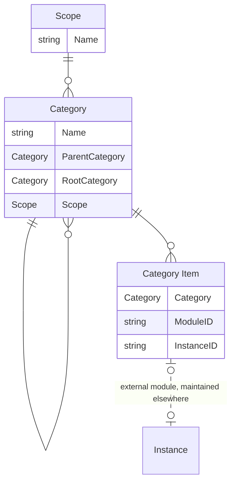

# Data Model

This document describes the data model for the Category and Category Item entities.

- **Scope**: defines the context in which categories exist.
- **Categories**: provide a hierarchical structure for grouping items within a specific scope. Categories can be nested to form a tree structure, with each category having a reference to its parent.
- **Category Items**: links specific items to categories. It serves only as a reference to a module/instance and does not store additional data.
- **Instance**: external module/instance, maintained outside the system.

